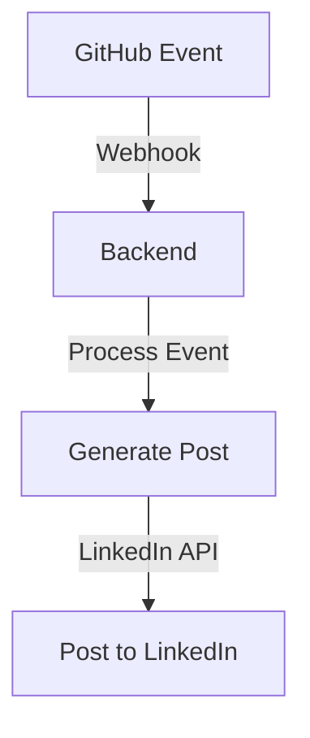

# GitHub LinkedIn Auto-Post

## Overview
This project automates the process of posting updates to LinkedIn based on GitHub activity. It integrates GitHub webhooks with LinkedIn's API to create posts whenever specific events occur in a GitHub repository, such as commits or pull requests.

## Features
- Automatically post GitHub activity to LinkedIn.
- Secure integration using environment variables and OAuth.
- CI/CD pipeline for automated testing and deployment.
- Modular and extensible codebase.

## Prerequisites
- Python 3.9 or higher
- Node.js 16 or higher
- PostgreSQL database
- LinkedIn Developer Account for API credentials
- GitHub repository with webhook support

## Setup Instructions

### 1. Clone the Repository
```bash
git clone https://github.com/your-username/github-linkedin-auto-post.git
cd github-linkedin-auto-post
```

### 2. Set Up Environment Variables
Create a `.env` file in the project root with the following variables:
```
SQLALCHEMY_DATABASE_URI=your_database_uri
LINKEDIN_ACCESS_TOKEN=your_linkedin_access_token
LINKEDIN_CLIENT_ID=your_linkedin_client_id
LINKEDIN_CLIENT_SECRET=your_linkedin_client_secret
DATABASE_URL=your_database_url
SECRET_GITHUB_TOKEN=yourGITHUB_token
SECRET_GITHUB_SECRET=yourGITHUB_secret
SEED_GITHUB_ID=your_SEED_GITHUB_id
SEED_GITHUB_USERNAME=your_SEED_GITHUB_username
SEED_GITHUB_TOKEN=your_SEED_GITHUB_token
SEED_LINKEDIN_ID=your_seed_linkedin_id
SEED_LINKEDIN_TOKEN=your_seed_linkedin_token
LINKEDIN_USER_ID=your_linkedin_user_id
```

### 3. Install Dependencies
#### Backend
```bash
python -m venv venv
source venv/bin/activate
pip install -r requirements.txt
```

#### Frontend
```bash
cd frontend
npm install
```

### 4. Run the Application
#### Backend
```bash
flask run
```

#### Frontend
```bash
cd frontend
npm start
```

## Testing
Run the test suite to ensure everything is working:
```bash
pytest
```

## Deployment
This project uses a `Procfile` for deployment to platforms like Heroku. Ensure all environment variables are set in the deployment environment.

## Contributing
Contributions are welcome! Please fork the repository and submit a pull request.

## License
This project is licensed under the MIT License. See the LICENSE file for details.

## Architecture Overview
This project is divided into two main components:

### Backend
- **Language**: Python (Flask framework)
- **Key Files**:
  - `app.py`: Entry point for the Flask application.
  - `routes/`: Contains route handlers for GitHub and LinkedIn integrations.
  - `services/`: Includes utility functions for LinkedIn OAuth, post generation, and signature verification.
  - `models.py`: Defines the database models.
  - `migrations/`: Manages database schema changes using Alembic.

### Frontend
- **Language**: JavaScript (React framework)
- **Key Files**:
  - `src/components/`: Contains reusable UI components like `Header`, `CommitList`, and `PostPreview`.
  - `src/utils/`: Includes helper functions for GitHub and LinkedIn actions.
  - `App.js`: Main application file.

## Use Cases
1. **Team Updates**: Automatically share GitHub activity to LinkedIn to keep stakeholders informed.
2. **Personal Branding**: Developers can showcase their contributions and projects on LinkedIn.
3. **Recruitment**: Organizations can highlight team achievements to attract talent.

## API Documentation
### GitHub Webhook Endpoint
- **URL**: `/webhook`
- **Method**: POST
- **Description**: Receives GitHub events and triggers LinkedIn posts.

### LinkedIn OAuth Callback
- **URL**: `/linkedin/callback`
- **Method**: GET
- **Description**: Handles LinkedIn OAuth flow and token exchange.

## Visual Workflow


## Troubleshooting
### Common Issues
1. **Invalid LinkedIn Token**:
   - Ensure the `LINKEDIN_ACCESS_TOKEN` is valid and not expired.
   - Use the `renew_linkedin_token.py` script to refresh the token.

2. **Webhook Signature Mismatch**:
   - Verify the `SECRET_GITHUB_SECRET` matches the webhook secret in your GitHub repository.

3. **Database Connection Errors**:
   - Check the `SQLALCHEMY_DATABASE_URI` in the `.env` file.
   - Ensure the PostgreSQL database is running and accessible.

## Screenshots
### Example LinkedIn Post


### Application UI


